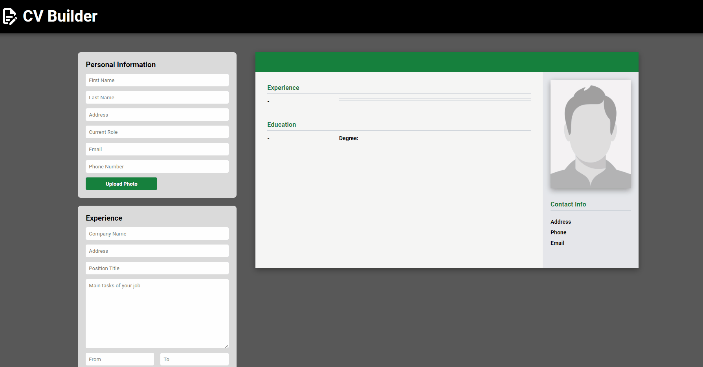

# CV Builder

[View live website here!](https://naknamu.github.io/cv-builder/)

A CV Builder that instantly updates upon user input.  
This application allows users to add or delete experience and education entries.  
There is also a button where users
can see an example cv and print or save it as PDF. 

## Features
- Dynamically updates upon data entry
- Can print CV
- Allow saving as PDF
- View an example CV
- Allow user to add photo
- Responsive design

### Sample CV Output demo

## Development
### Web Framework
- React
